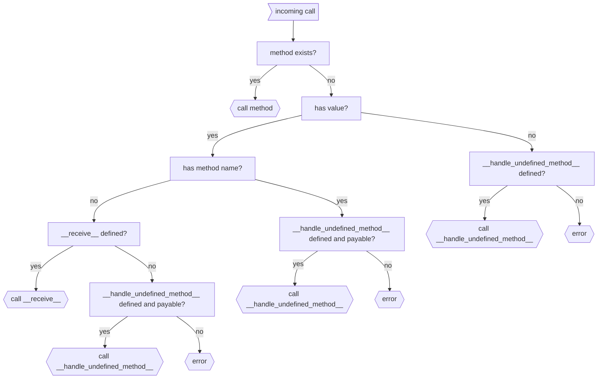

# Value Transfers

Source: https://docs.genlayer.com/developers/intelligent-contracts/features/value-transfers

## Native Token (GEN)

GenLayer uses GEN as its native token. Values are denominated in wei (1 GEN = 10¹⁸ wei). Use the `u256` type for value amounts in contract code.

## Receiving Value

Mark a method as payable with `@gl.public.write.payable` to accept GEN:

```python
from genlayer import *

class TipJar(gl.Contract):
    def __init__(self):
        self.total_tips = u256(0)

    @gl.public.write.payable
    def tip(self) -> None:
        v = gl.message.value
        if v == u256(0):
            raise gl.vm.UserError("send some value")
        self.total_tips = self.total_tips + v

    @gl.public.view
    def get_tips(self) -> u256:
        return self.total_tips
```

`gl.message.value` is a `u256` containing the GEN sent with the call. It is only available in methods decorated with `@gl.public.write.payable`.

## Sending Value to Another Intelligent Contract

Send value to another IC using [internal messages](/developers/intelligent-contracts/features/messages#internal-messages-ic--ic):

```python
other = gl.get_contract_at(recipient_address)

# Pure value transfer (triggers __receive__ on recipient)
other.emit_transfer(value=u256(amount), on='finalized')

# Value + method call (recipient method must be payable)
other.emit(value=u256(amount), on='finalized').deposit()
```

### How Value Flows

When a message with value is emitted, the value is **immediately deducted** from the sending contract's balance and held in the message. It is only credited to the recipient when the message's child transaction is activated. The flow is:

**Sender balance → message → recipient balance**

If the child transaction fails, the value is not automatically returned to the sender.

See [Messages](/developers/intelligent-contracts/features/messages) for details on timing (`on='accepted'` vs `on='finalized'`).

## Sending Value to an EOA or EVM Contract

Sending to an address on the GenLayer Chain (EOA or EVM contract) is an [external message](/developers/intelligent-contracts/features/messages#external-messages-ic--chain-layer). It goes through the IC's [ghost contract](/developers/intelligent-contracts/features/messages#ghost-contracts) and always executes on finalization.

```python
@gl.evm.contract_interface
class _Recipient:
    class View:
        pass
    class Write:
        pass

class Faucet(gl.Contract):
    @gl.public.write.payable
    def send(self, recipient: str) -> None:
        v = gl.message.value
        if v == u256(0):
            raise gl.vm.UserError("send some value")
        _Recipient(Address(recipient)).emit_transfer(value=v)
```

> **Note:**
  The syntax for sending to an EOA uses the EVM contract interface even though the recipient is not a contract. This is because EOAs live on the chain layer, making this an external message — the same mechanism used for calling EVM contracts. This will be simplified in a future version.

## Reading Balances

```python
# Own contract balance
my_balance = self.balance

# Another IC's balance
other_balance = gl.get_contract_at(addr).balance

# EVM contract balance
evm_balance = EthContract(addr).balance
```

In `write` methods, `self.balance` reflects the current state including any value received in the current call. In `view` methods, it shows a snapshot without modifications.

### Where Balance Lives

On the GenLayer network, an IC's GEN balance is held by its [ghost contract](/developers/intelligent-contracts/features/messages#ghost-contracts) on the chain layer. `self.balance` reads from this. The balance is visible on both layers.

> **Note:**
  **Studio:** Balances are simulated in a local database. There is no EVM layer or ghost contracts in Studio.

## Receiving Value Without a Method Call

When value is sent without specifying a method, the contract can handle it with special methods:

```python
class Contract(gl.Contract):
    @gl.public.write.payable
    def __receive__(self):
        """Called for value-only transfers with no method name."""
        pass

    @gl.public.write.payable
    def __handle_undefined_method__(
        self, method_name: str, args: list, kwargs: dict
    ):
        """Fallback for calls to undefined methods."""
        pass
```

The dispatch logic:



## Funding Accounts

| Environment | How to fund |
|---|---|
| Studio (Localnet) | Built-in faucet — 💧 button in the account selector |
| Studionet | Built-in faucet — 💧 button in the account selector |
| Testnet Asimov | [testnet-faucet.genlayer.foundation](https://testnet-faucet.genlayer.foundation/) |
| Testnet Bradbury | [testnet-faucet.genlayer.foundation](https://testnet-faucet.genlayer.foundation/) |

See [Networks](/developers/networks) for full details on each environment.

## Calling Payable Methods from JavaScript

Use the `value` parameter in `writeContract()` to send GEN:

```typescript
import { createClient, createAccount } from 'genlayer-js';
import { testnetAsimov } from 'genlayer-js/chains';

const client = createClient({
  chain: testnetAsimov,
  account: createAccount(),
});

const txHash = await client.writeContract({
  address: contractAddress,
  functionName: 'tip',
  args: [],
  value: BigInt(5) * BigInt(10 ** 18), // 5 GEN in wei
});
```
