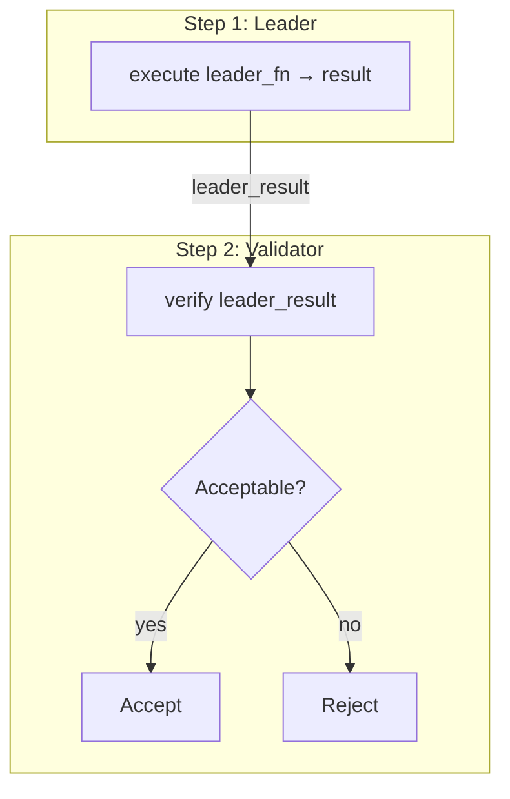
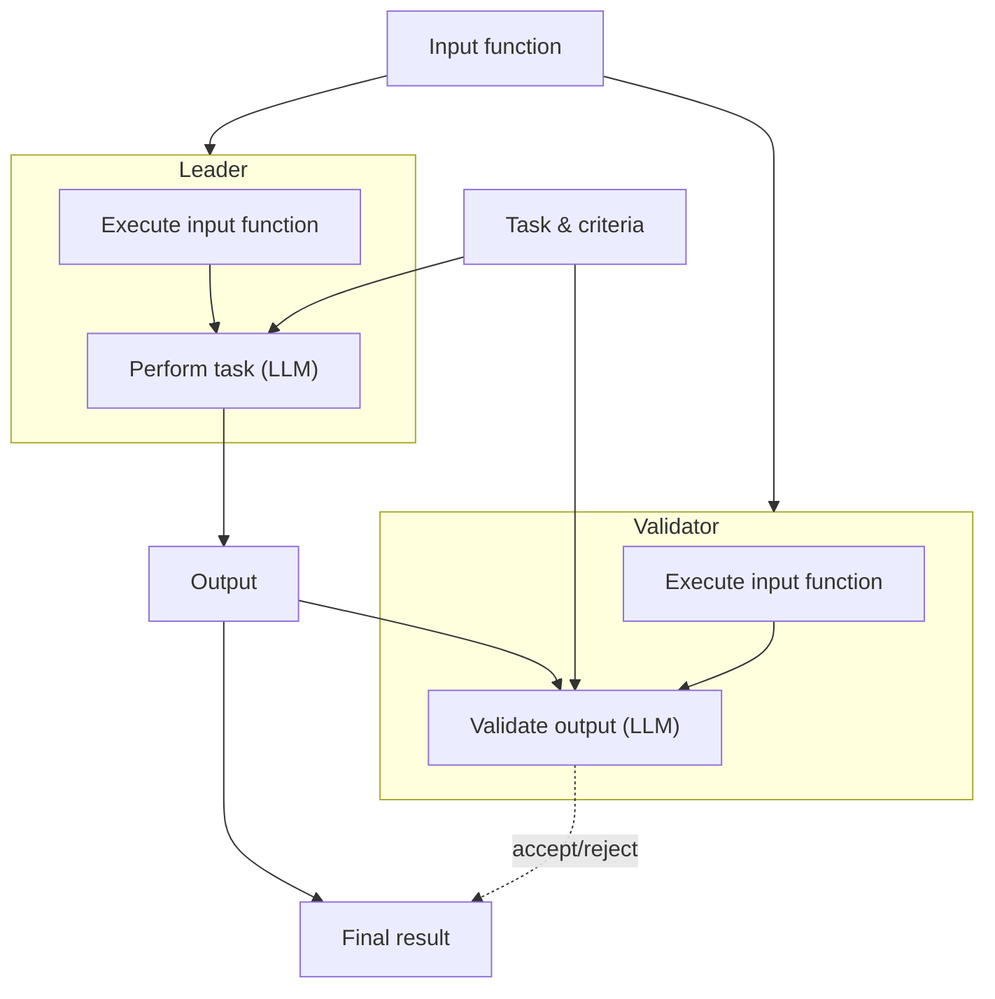

# The Equivalence Principle

Source: https://docs.genlayer.com/developers/intelligent-contracts/equivalence-principle

The Equivalence Principle is how GenLayer achieves consensus on non-deterministic operations — things like web requests, LLM calls, or any computation that might produce different results on different nodes.

The core idea: a **leader** executes the operation and proposes a result, then **validators** independently verify whether that result is acceptable.

## Quick Reference: Which Pattern to Use

```
Can validators reproduce the exact same normalized output?
├── YES → strict_eq
│         Exact match. Use when outputs are deterministic or can be
│         canonicalized (e.g., JSON with sort_keys=True).
│         Examples: blockchain RPC, stable REST APIs.
│
└── NO  → Write a custom validator function (run_nondet_unsafe)
          You control the full logic: rerun and compare with tolerances,
          derive status, extract stable fields, or evaluate the leader's
          output directly without rerunning — whatever your contract needs.
```

For most contracts, you'll write a custom validator function. It gives you full control over comparison logic and error handling.

> **Note:**
GenLayer also provides `prompt_comparative` and `prompt_non_comparative` as convenience wrappers for common patterns, but in practice most contracts outgrow them quickly. Starting with a custom validator function gives you full flexibility from the start.

## The Leader/Validator Pattern

Every non-deterministic operation in GenLayer is built on two functions:

```python
def leader_fn() -> T:
    # Fetch data, call an LLM, compute something
    return result

def validator_fn(leader_result) -> bool:
    # Independently verify the leader's result
    # Returns True to accept, False to reject
    return is_acceptable
```

The leader's result is only accepted if a majority of validators agree. If the majority rejects, the network rotates to a different leader and retries. If consensus still can't be reached, the transaction goes **undetermined** — it does not modify contract state.

> **Note:**
  **What gets stored?** The accepted leader result is the value your contract receives and can store. Validators verify or reject that leader result; their independent intermediate answers are not automatically persisted on-chain. If your application needs to expose multiple perspectives, make those perspectives explicit fields in the leader result and write validator logic that checks them.



The typical validator pattern is: **re-run the leader function independently, then compare the results**. How you compare determines which validation pattern you're using.

> **Note:**
  **Always extract before comparing.** Raw web data varies between nodes (caching, cookies, dynamic content) and is expensive to write to the GenLayer chain — whatever data the leader returns has to be stored on-chain. The typical pattern is: **fetch web data → LLM extraction → return structured data**, all within the same non-deterministic block.

## Validation Patterns

### Pattern 1: Partial Field Matching

Often your leader function returns structured data with both an **analysis** (subjective text) and a **decision** (objective fields). Two LLMs will produce different analysis text, but should agree on the decision. Compare only the fields that matter:

```python
@gl.public.write
def resolve_match(self, match_id: str):
    match = self.matches[match_id]

    def leader_fn():
        web_data = gl.nondet.web.get(match.source_url)
        prompt = f"""
        Analyze this match and determine the result.
        Teams: {match.team1} vs {match.team2}
        Page content: {web_data.body}
        Return JSON: {{
            "analysis": "your reasoning about the match result",
            "score": "X:Y",
            "winner": 1 or 2 or 0 for draw, or -1 if not finished
        }}
        """
        response = gl.nondet.exec_prompt(prompt)
        # In production, add retry/validation around JSON parsing
        return json.loads(response)

    def validator_fn(leader_result) -> bool:
        if not isinstance(leader_result, gl.vm.Return):
            return False
        validator_data = leader_fn()
        leader_data = leader_result.calldata
        # Only compare the decision fields — analysis text will differ
        return (
            leader_data["winner"] == validator_data["winner"]
            and leader_data["score"] == validator_data["score"]
        )

    result = gl.vm.run_nondet_unsafe(leader_fn, validator_fn)

    if result["winner"] == -1:
        raise gl.vm.UserError("Game not finished")
    self.matches[match_id].winner = result["winner"]
    self.matches[match_id].score = result["score"]
    self.matches[match_id].analysis = result["analysis"]
```

The `analysis` field is stored but not compared — two LLMs will word their reasoning differently. The `winner` and `score` fields are the decision and must match exactly.

> **Note:**
  If you only need the decision fields (not the analysis), you can use `strict_eq` instead — see [Convenience Functions](#strict-equality-strict_eq).

### Pattern 2: Numeric Tolerance

When results are numeric but may vary slightly between nodes, compare within a threshold. This is common for two reasons:
- **Time drift**: prices change between leader and validator execution
- **LLM subjectivity**: quality scores from different LLMs rarely match exactly

#### Price Oracle

The most common use case — fetching a price that may drift between when the leader and validator execute:

```python
@gl.public.write
def update_price(self, pair: str):
    url = f"https://api.example.com/prices/{pair}"

    def leader_fn():
        response = gl.nondet.web.get(url)
        data = json.loads(response.body)
        return data["price"]

    def validator_fn(leader_result) -> bool:
        if not isinstance(leader_result, gl.vm.Return):
            return False
        validator_price = leader_fn()
        leader_price = leader_result.calldata
        # 2% tolerance — price may drift between leader and validator execution
        if leader_price == 0:
            return validator_price == 0
        return abs(leader_price - validator_price) / abs(leader_price) <= 0.02

    self.prices[pair] = gl.vm.run_nondet_unsafe(leader_fn, validator_fn)
```

#### Quality Scoring

For LLM-generated scores, use absolute tolerance — two LLMs rating the same content rarely give identical scores:

```python
@gl.public.write
def evaluate_submission(self, submission_id: str):
    submission = self.submissions[submission_id]

    def leader_fn():
        web_data = gl.nondet.web.get(submission.content_url)
        prompt = f"""
        Rate the quality of this content on a scale of 0-10.
        Guidelines: {submission.guidelines}
        Content: {web_data.body}
        Return JSON: {{"score": N, "analysis": "brief explanation"}}
        """
        response = gl.nondet.exec_prompt(prompt)
        return json.loads(response)

    def validator_fn(leader_result) -> bool:
        if not isinstance(leader_result, gl.vm.Return):
            return False
        validator_data = leader_fn()
        leader_score = leader_result.calldata["score"]
        validator_score = validator_data["score"]
        # Gate: if either scores 0 (reject), both must agree on rejection
        if leader_score == 0 or validator_score == 0:
            return leader_score == validator_score
        # Otherwise allow ±1 tolerance
        return abs(leader_score - validator_score) <= 1

    result = gl.vm.run_nondet_unsafe(leader_fn, validator_fn)
    self.submissions[submission_id].score = result["score"]
    self.submissions[submission_id].analysis = result["analysis"]
```

The gate check (score 0) ensures that if one node thinks the content should be rejected outright, both must agree — you don't want a ±1 tolerance to turn a rejection into an acceptance.

### Pattern 3: LLM Comparison (Comparative)

When results are complex (text, structured analysis) and can't be reduced to numbers, you can use an LLM to decide whether two outputs are equivalent.

The simplest way is `prompt_comparative`:

```python
result = gl.eq_principle.prompt_comparative(
    evaluate_single_source,
    principle="`outcome` field must be exactly the same. All other fields must be similar",
)
```

This uses a special `EqComparative` prompt template — not a regular `gl.nondet.exec_prompt` call. Node operators can customize these templates to tune how their validators evaluate equivalence, improving judgment quality over time. This is a key advantage over writing your own comparison prompts.

For more control while keeping this benefit, use the template directly in a custom `run_nondet_unsafe` validator. This lets you combine LLM-based comparison with programmatic checks:

> **Note:**
  The imports below use internal module paths (`_internal`, `_decode_nondet`). The template functionality is stable and used by all convenience functions, but the import path may change in future releases.

```python
import genlayer.gl._internal.gl_call as gl_call
from genlayer.gl.nondet import _decode_nondet

@gl.public.write
def analyze_event(self, event_id: str):
    event = self.events[event_id]

    def leader_fn():
        web_data = gl.nondet.web.get(event.source_url)
        prompt = f"""
        Analyze this event and determine the outcome.
        Title: {event.title}
        Possible outcomes: {event.outcomes}
        Page content: {web_data.body}
        Return JSON: {{
            "reasoning": "your detailed analysis",
            "outcome": "chosen outcome or UNDETERMINED"
        }}
        """
        response = gl.nondet.exec_prompt(prompt)
        return json.loads(response)

    def validator_fn(leader_result) -> bool:
        if not isinstance(leader_result, gl.vm.Return):
            return False
        validator_data = leader_fn()

        # Use the EqComparative template — node operators can customize this
        verdict = gl_call.gl_call_generic(
            {
                'ExecPromptTemplate': {
                    'template': 'EqComparative',
                    'leader_answer': format(leader_result.calldata),
                    'validator_answer': format(validator_data),
                    'principle': "`outcome` must match exactly. Reasoning may differ.",
                }
            },
            _decode_nondet,
        ).get()

        return verdict

    result = gl.vm.run_nondet_unsafe(leader_fn, validator_fn)
    self.events[event_id].outcome = result["outcome"]
    self.events[event_id].analysis = result["reasoning"]
```

The `EqComparative` template sends both answers and your principle to the validator's LLM, which returns `true`/`false`. Because this goes through the template system, node operators can fine-tune the comparison prompt for their specific LLM — getting better judgment over time without any contract changes.

**When to use:** Results are rich (text + structured data) and you need natural-language equivalence judgment — "outcomes must match", "key facts must agree", "sentiments must be the same".

> **Note:**
  If comparative LLM comparison is too loose or too strict, consider whether you can reduce the problem to [partial field matching](#pattern-1-partial-field-matching) or [numeric tolerance](#pattern-2-numeric-tolerance) — those give you deterministic, programmatic control.

### Pattern 4: Non-Comparative Validation

In rare cases, you may not want the validator to repeat the leader's work at all. Instead, the validator **evaluates the leader's output** against the source data.



Note that the validator **does not perform the task** — it only judges whether the leader's output satisfies the criteria given the input.

The simplest way is `prompt_non_comparative`:

```python
@gl.public.write
def summarize_article(self, url: str):
    result = gl.eq_principle.prompt_non_comparative(
        lambda: gl.nondet.web.get(url).body.decode("utf-8"),
        task="Summarize this article in 2-3 sentences",
        criteria="""
            Summary must capture the main point of the article
            Must not include information not present in the source
            Must be 2-3 sentences long
        """
    )
    self.summaries[url] = result
```

Under the hood, this uses two special templates:
- **`EqNonComparativeLeader`**: takes the input + task + criteria → produces the output
- **`EqNonComparativeValidator`**: takes the input + leader's output + task + criteria → judges validity

For more control, use these templates directly. Here the leader summarizes an article, and the validator uses the `EqNonComparativeValidator` template to judge the summary:

```python
import genlayer.gl._internal.gl_call as gl_call
from genlayer.gl.nondet import _decode_nondet

@gl.public.write
def summarize_article(self, url: str):
    task = "Summarize this article in 2-3 sentences"
    criteria = """
        Summary must capture the main point of the article.
        Must not include information not present in the source.
        Must be 2-3 sentences long.
    """

    def leader_fn():
        web_data = gl.nondet.web.get(url).body.decode("utf-8")
        result = gl_call.gl_call_generic(
            {
                'ExecPromptTemplate': {
                    'template': 'EqNonComparativeLeader',
                    'task': task,
                    'input': web_data,
                    'criteria': criteria,
                }
            },
            _decode_nondet,
        ).get()
        return result

    def validator_fn(leader_result) -> bool:
        if not isinstance(leader_result, gl.vm.Return):
            return False
        web_data = gl.nondet.web.get(url).body.decode("utf-8")
        verdict = gl_call.gl_call_generic(
            {
                'ExecPromptTemplate': {
                    'template': 'EqNonComparativeValidator',
                    'task': task,
                    'input': web_data,
                    'output': leader_result.calldata,
                    'criteria': criteria,
                }
            },
            _decode_nondet,
        ).get()
        return verdict

    self.summaries[url] = gl.vm.run_nondet_unsafe(leader_fn, validator_fn)
```

The validator never writes its own summary — it only judges whether the leader's summary is faithful to the source. And because it uses the `EqNonComparativeValidator` template, node operators can tune the judgment prompt for their LLM.

> **Note:**
  Non-comparative validation is rare in practice. Most use cases are better served by patterns 1-3 where the validator independently reproduces the result. Non-comparative is most useful when the output is open-ended and there's no meaningful way to compare two independent results — e.g., summarization, where two valid summaries can be completely different yet both correct.

## `run_nondet` vs `run_nondet_unsafe`

GenLayer provides two variants for custom leader/validator logic. The difference is **who handles validator errors**.

When writing custom leader/validator patterns, **use `run_nondet_unsafe`** and handle errors yourself inside the validator. This is what production contracts do — it gives you full control over error classification and comparison logic. If the validator throws an unhandled exception, it counts as `Disagree` (same as returning `False`).

```python
result = gl.vm.run_nondet_unsafe(leader_fn, validator_fn)
```

**`gl.vm.run_nondet`** is primarily used internally by the [convenience functions](#convenience-functions). It wraps the validator in a sandbox — if the validator throws, the sandbox catches it and compares the error against the leader's error using configurable comparison functions:

```python
result = gl.vm.run_nondet(
    leader_fn,
    validator_fn,
    # Optional: customize how errors are compared (default: message equality)
    compare_user_errors=my_user_error_comparator,
    compare_vm_errors=my_vm_error_comparator
)
```

| | `gl.vm.run_nondet_unsafe` | `gl.vm.run_nondet` |
|---|---|---|
| **Validator errors** | Unhandled exceptions = `Disagree` | Caught by sandbox, compared automatically |
| **Error handling** | You implement it inside `validator_fn` | Built-in with `compare_user_errors` / `compare_vm_errors` callbacks |
| **Use for** | Custom leader/validator patterns (recommended) | Convenience functions and simple validators where built-in error comparison suffices |

### Advanced Error Handling with `run_nondet_unsafe`

When your contract makes external calls that can fail in different ways, you may want to classify errors and handle each type differently. With `run_nondet_unsafe`, you implement this inside the validator:

```python
ERROR_EXPECTED = "[EXPECTED]"    # Business logic errors (deterministic)
ERROR_EXTERNAL = "[EXTERNAL]"    # External API errors (deterministic)
ERROR_TRANSIENT = "[TRANSIENT]"  # Temporary failures (timeouts, 5xx)
ERROR_LLM = "[LLM_ERROR]"       # LLM/GenVM errors (non-deterministic)

def _handle_leader_error(leaders_res, leader_fn) -> bool:
    """Re-run leader_fn on validator and compare errors."""
    leader_msg = leaders_res.message if hasattr(leaders_res, 'message') else ''
    try:
        leader_fn()
        return False  # Leader errored but validator succeeded — disagree
    except gl.vm.UserError as e:
        validator_msg = e.message if hasattr(e, 'message') else str(e)
        # Deterministic errors: must match exactly
        if validator_msg.startswith(ERROR_EXPECTED) or validator_msg.startswith(ERROR_EXTERNAL):
            return validator_msg == leader_msg
        # Transient errors: both transient = agree
        if validator_msg.startswith(ERROR_TRANSIENT) and leader_msg.startswith(ERROR_TRANSIENT):
            return True
        # LLM errors or unknown: disagree, force retry
        return False
    except Exception:
        return False
```

Use this helper in your validator:

```python
def validator_fn(leaders_res) -> bool:
    if not isinstance(leaders_res, gl.vm.Return):
        return _handle_leader_error(leaders_res, leader_fn)
    validator_result = leader_fn()
    return abs(leaders_res.calldata["score"] - validator_result["score"]) <= 1
```

This gives fine-grained control:
- **Expected/external errors** (e.g., "issue not found"): must match exactly
- **Transient errors** (e.g., API timeout): if both nodes fail transiently, agree
- **LLM errors**: always disagree — force retry with different validators

### The Validator's Result Parameter

The validator function receives a `gl.vm.Result` which can be one of:
- **`gl.vm.Return[T]`** — leader succeeded; access the value via `.calldata`
- **`gl.vm.UserError`** — leader raised an application error
- **`gl.vm.VMError`** — leader hit a VM-level error (e.g., out of memory)

Always check the type before accessing the result:

```python
def validator_fn(leader_result) -> bool:
    if not isinstance(leader_result, gl.vm.Return):
        return False  # reject if leader errored
    data = leader_result.calldata
    # ... verify data
```

## Convenience Functions

GenLayer provides built-in equivalence functions for common patterns. These are shortcuts so you don't have to write leader/validator pairs manually.

### Strict Equality (`strict_eq`)

All validators execute the same function. Results must match **exactly**. Uses `run_nondet_unsafe` under the hood.

```python
def fetch_match_result():
    web_data = gl.nondet.web.get(resolution_url)
    prompt = f"""
    Find the match result for {team1} vs {team2}.
    Page: {web_data.body}
    Return JSON: {{"score": "X:Y", "winner": 1 or 2 or 0}}
    """
    result = gl.nondet.exec_prompt(prompt)
    return json.dumps(json.loads(result), sort_keys=True)

result = json.loads(gl.eq_principle.strict_eq(fetch_match_result))
```

**Use when:** results are objective and should be identical — API data, boolean decisions, structured data where you don't need separate analysis text.

> **Note:**
  Note the `sort_keys=True` — JSON key ordering can vary between nodes. Sorting ensures exact string comparison works. If you need to compare only some fields or allow tolerance, use a custom leader/validator pattern instead.

### Comparative (`prompt_comparative`)

Both leader and validators perform the same task, then a **special LLM prompt template** compares their results against a principle you define. Uses `run_nondet` under the hood.

```python
result = gl.eq_principle.prompt_comparative(
    evaluate_source,
    principle="`outcome` must be exactly the same. All other fields must be similar"
)
```

The comparison uses a built-in `EqComparative` prompt template that node operators can customize. The LLM receives the leader's answer, the validator's answer, and your principle, then returns true/false.

**Use when:** results are complex (text + data) and you need natural-language equivalence criteria — "key facts must match", "conclusions must agree", "numerical values within 10%".

### Non-Comparative (`prompt_non_comparative`)

The leader performs a task, and validators evaluate the leader's output against criteria — **without repeating the task themselves**. Uses `run_nondet` under the hood.

```python
result = gl.eq_principle.prompt_non_comparative(
    lambda: gl.nondet.web.get(url).body.decode("utf-8"),
    task="Classify the sentiment as positive, negative, or neutral",
    criteria="""
        Output must be one of: positive, negative, neutral
        Consider context and tone
        Account for sarcasm and idioms
    """
)
```

Parameters:
- **`fn`** — function that provides the input data (runs on both leader and validator)
- **`task`** — instruction for the leader's LLM
- **`criteria`** — rules the validator's LLM uses to judge the leader's output

**Use when:** the task is subjective (NLP, classification, extraction) and you want validators to judge output quality rather than reproduce it.

## Writing Secure Validators

The validator's job is to **prevent malicious or incorrect data** from being accepted. A validator that always returns `True` defeats the entire consensus mechanism — it would let a single malicious node set any result.

**Bad — accepts anything:**
```python
def validator(leader_result):
    return True  # Insecure! Leader can return arbitrary data
```

**Good — independent verification:**
```python
def validator(leader_result):
    if not isinstance(leader_result, gl.vm.Return):
        return False
    my_data = leader_fn()  # re-run independently
    return abs(leader_result.calldata - my_data) <= tolerance
```

Guidelines:
1. **Never trust the leader** — always verify what you can independently
2. **Tolerate nondeterminism** — use thresholds for scores, percentage tolerance for prices, field-level comparison for structured data
3. **Check error types** — handle `UserError` and `VMError` before accessing `.calldata`
4. **Reject when in doubt** — security first
